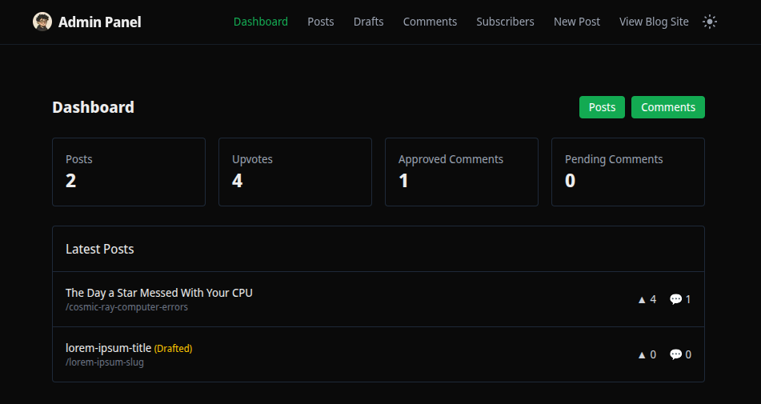

# Personal Blog Admin Panel (Private Repository)

A modern admin dashboard for managing your Personal Blog, built with Next.js, TypeScript, and Tailwind CSS.



## ✨ Features

- **Dashboard Overview**: See total posts, upvotes, approved/pending comments, and latest posts at a glance.
- **Post Management**: Create, edit, publish, or save blog posts as drafts.
- **Markdown Support**: Write posts using Markdown with live preview.
- **Image Upload**: Drag-and-drop image uploads with Cloudinary integration.
- **Comment Moderation**: Approve or reject comments before they appear on the blog.
- **Subscribers Management**: View and manage blog subscribers.
- **Dark/Light Mode**: Theme toggle with system preference detection.
- **Fast & Responsive**: Built with Next.js App Router and Tailwind CSS.

## 🛠️ Tech Stack

- **Framework**: Next.js 14 (App Router)
- **Language**: TypeScript
- **Styling**: Tailwind CSS
- **Database**: MongoDB (shared with main blog)
- **Image Hosting**: Cloudinary
- **Email Service**: SendGrid

## 📦 Prerequisites

- Node.js 18.x or later
- npm package manager
- Access to the same MongoDB, Cloudinary, and environment variables as the main blog

## 🚀 Getting Started

1. **Clone the repository**

   ```bash
   git clone https://github.com/anuragparashar26/personal-blog-admin-panel
   cd personal-blog-admin-panel
   ```

2. **Install dependencies**

   ```bash
   npm install
   ```

3. **Environment Setup**

   Create a `.env` file in the root directory and add the following variables (same as your main blog):

   ```env
   MONGODB_URI=your_mongodb_connection_string
   CLOUDINARY_CLOUD_NAME=your_cloudinary_cloud_name
   CLOUDINARY_API_KEY=your_cloudinary_api_key
   CLOUDINARY_API_SECRET=your_cloudinary_api_secret
   MAILGUN_API_KEY=your_mailgun_api_key
   MAILGUN_DOMAIN=your_mailgun_domain
   MAILGUN_MAILING_LIST=your_mailgun_mailing_list_address
   MAILGUN_FROM_EMAIL=your_sender_email@example.com
   NEXT_PUBLIC_BASE_URL=your-admin-panel.vercel.app
   IP_SALT=your_ip_salt_here
   NODE_ENV=development
   ```

4. **Run the development server**

   ```bash
   npm run dev
   ```

   Open [http://localhost:3001](http://localhost:3001) (or your configured port) to access the admin panel.

## 🖋️ Post Markdown

Posts are written in [Markdown](https://www.markdownguide.org/), allowing you to easily format text, add links, images, code blocks, and more. The editor provides a live preview so you can see your formatted content as you write.

**Supported Markdown features include:**

- Headings, bold, italics, lists
- Links and images (with Cloudinary integration)
- Code blocks and inline code
- Blockquotes and tables

For more details, see the [Markdown Guide](https://www.markdownguide.org/basic-syntax/).

## 📁 Project Structure

```
personal-blog-admin-panel/
├── src/
│   ├── app/                 # App Router pages
│   ├── components/          # Reusable components (Header, ThemeToggle, etc.)
│   ├── lib/                 # Utility functions (Cloudinary, MongoDB, etc.)
│   └── contexts/            # React contexts (Theme, etc.)
├── public/                  # Static assets
├── package.json
├── tailwind.config.ts
├── next.config.ts
└── tsconfig.json
```

## 📄 License

This project is currently private and does not have any license.

---

Built with ❤️ using Next.js and Tailwind CSS.
